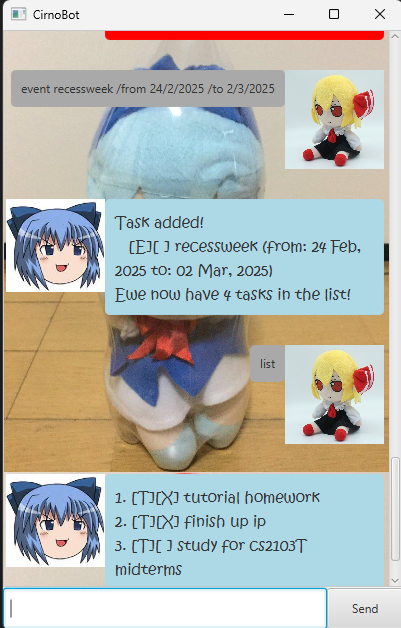

# CirnoBot

// Update the title above to match the actual product name

>Yukkuri shiteitte ne! - [Yukkuri](https://myanimeshelf.com/figures/2716027_Touhou_Project_Plush_Yukkuri_Reimu_%28Deka_Size%29)




Ever wanted a Yukkuri to help you keep track of your tasks? Doesn't matter, here it is anyway!

- Keeps tracks of tasks!
- Yells at you when you enter commands wrongly!
- Speaks in a vaguely Yukkuri-like manner!
- Catch a glimpse of the rare fumo!

All you need to do is,

1. Download it!
2. Double-click it!
3. Add your tasks!
4. Let it manage your tasks for you! 😉

And it is FREE!

> [!TIP]
> Enter help into the text box and click enter to get a list of commands!

> [!NOTE]
> Help command not implemented yet.


Features:

- [x] Managing tasks!
- [x] Managing deadlines!
- [ ] ~~Reminders~~

## Adding todo tasks!

Enter the keyword `todo` followed by the name of your task!

Example: `todo run`


## Adding deadlines!

Enter the keyword `deadline` followed by the name of your task! After that put `/by` and the deadline itself!

// Give examples of usage

Example: `deadline submit ip /by 11:59pm`

// A description of the expected outcome goes here

```
Your Cirno will now track your task and your designated deadline!
```

## Adding event tasks!

Enter the keyword `event` followed by the name of your task! After that enter your starting time behind `/from` and 
your ending time after `/to`!

Example: `event cs2103T midterms /from 3/3/2025 3pm /to 3/3/2025 5pm`

# Listing tasks

Enter `list` to display every task

## Use tags!

Enter `/tag` followed by the tag! Can be used for additional snippets of information!

Example: `todo run /tag important`


## Locate Tasks!

Use `find` to search through every task!

Example: `find run`

## Mark (and Unmark) tasks!

Use `mark` to track your progress!

Example: `mark 1`

## Delete tasks!

Example: `delete 1`